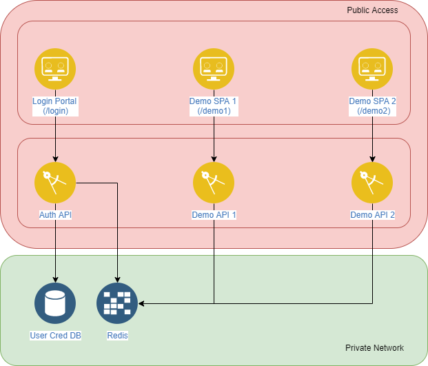

# Federated Identity Demo
This is a demonstration project for a set of microservices that use federated identity to authenticate and authorise users.

## Architecture

### Frontend Architecture
The frontend consists of three Angular SPAs. One being a login portal, the other two being demo applications to demonstrate federated identity.
The SPA is responsible for initialising a user's session with the Auth API. The two demo SPAs also interact with the Auth API to confirm that the user is logged in based on the session token stored as a cookie.

### Backend
The backend consists of three .NET 6.0 APIs the Auth API and two Demo API, is responsible for management of the sessions. The Auth API is responsible for authenticating the user and then populating the Redis cache with the authorisation information for a given user. Stored using the session token as a key. The other two APIs use the session token provided by in the request to perform a lookup in the cache to authenticate the user and retrieve their permissions.